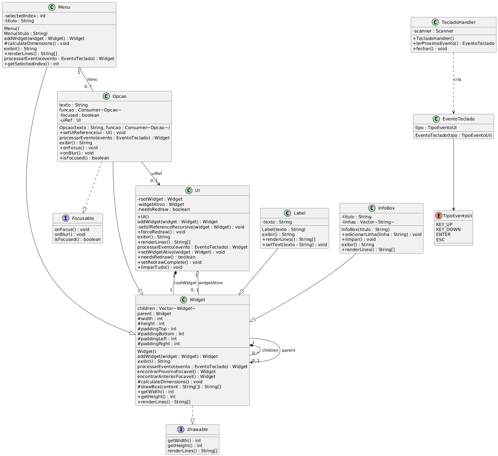
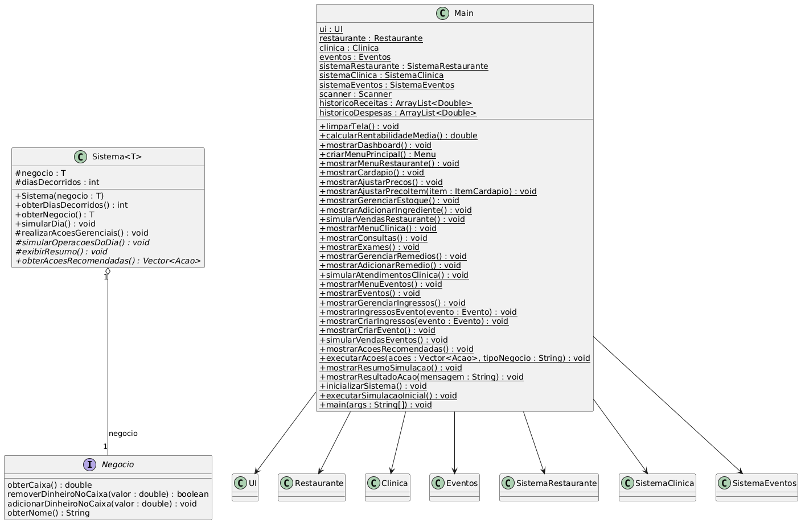
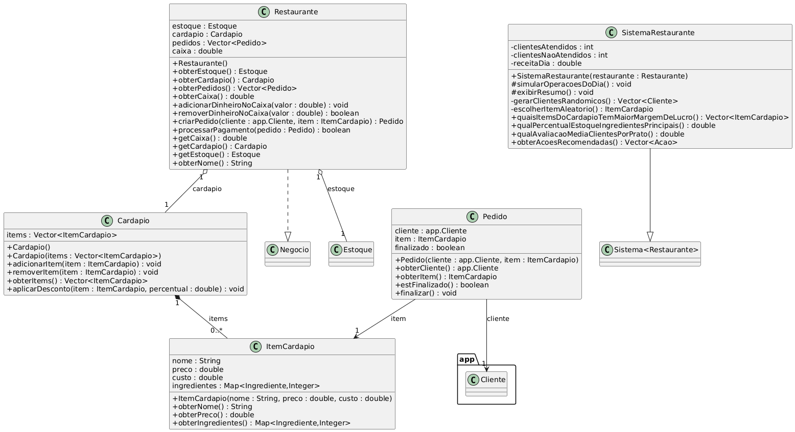
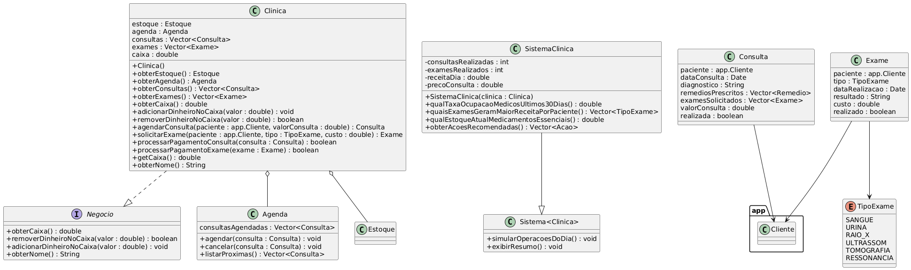
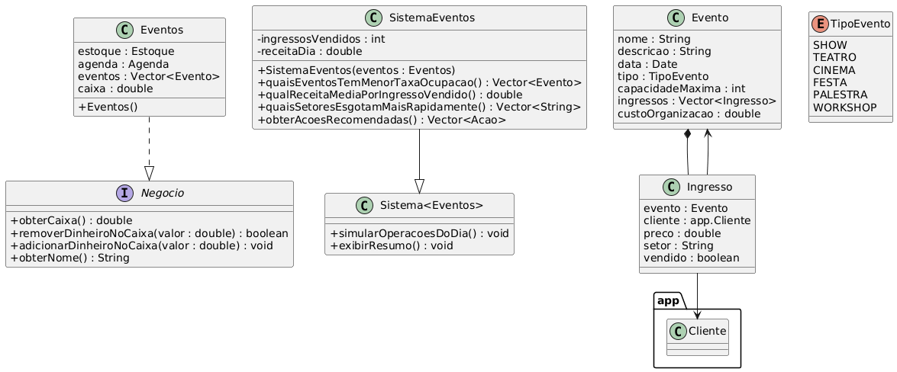
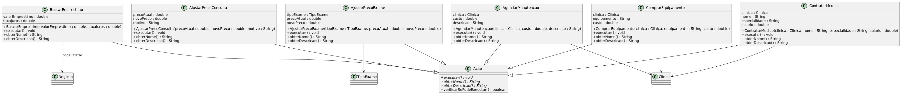
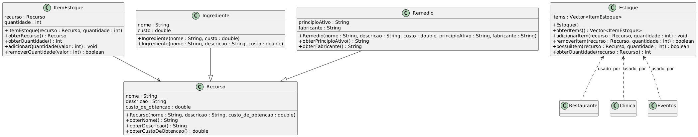

# Sistema Integrado de Gestão (Projeto POO - 2a Parte)

## Sobre o Projeto
Este projeto é uma simulação de um sistema integrado de gestão para múltiplos negócios (Restaurante, Clínica e Eventos), desenvolvido como trabalho da disciplina de **Programação Orientada a Objetos (POO)**. O sistema modela operações diárias de cada estabelecimento, oferece interface interativa e fornece recomendações estratégicas baseadas em análise de dados.

## Perguntas Respondidas com Métodos

### Restaurante
1. Quais items do cardápio tem maior margem de lucro?
2. Qual o percentual de estoque de ingredientes principais?
3. Qual a avaliação média dos clientes por prato?

### Clínica 
1. Qual a taxa de ocupação dos médicos nos últimos 30 dias?
2. Quais exames geram maior receita por paciente?
3. Qual o estoque atual de medicamentos essenciais?

### Eventos
1. Quais eventos tem menor taxa de ocupação?
2. Qual a receita média por ingresso vendido?
3. Quais setores esgotam mais rapidamente?

> IMPORTANTE: Os métodos para cada pergunta estão implementados dentro dos sistemas em src/app/sistema/...

## Como Executar

### Pré-requisitos
- Java 21 ou superior 
- Sistema operacional Linux ou Windows (Recomendamos que use o MinGW)
- Makefile

### Compilação e Execução
1. Clone o repositório
```bash
git clone https://github.com/seu-usuario/SistemaIntegrado
cd SistemaIntegrado
```

2. Compile o projeto
```bash
make build
```

3. Execute o programa
```bash
make run
```

## Interface do Usuário
O sistema utiliza interface de linha de comando com navegação por teclas:
- **W/S**: Navegar entre opções
- **Enter**: Selecionar
- **Q**: Sair/Voltar

## Estrutura do Projeto
```
src/app/
├── Main.java                    # Classe principal e interface
├── Cliente.java                 # Representação de clientes
├── Estoque.java                 # Controle de estoque
├── Agenda.java                  # Gestão de agenda
├── Recurso.java                 # Classe base para recursos
├── sistema/
│   ├── Sistema.java             # Sistema base
│   ├── SistemaRestaurante.java  # Sistema do restaurante  
│   ├── SistemaClinica.java      # Sistema da clínica
│   └── SistemaEventos.java      # Sistema de eventos
├── restaurante/
│   ├── Restaurante.java
│   ├── Cardapio.java
│   ├── ItemCardapio.java
│   └── [outras classes...]
├── clinica/
│   ├── Clinica.java
│   ├── Consulta.java 
│   ├── Exame.java
│   └── [outras classes...]
├── eventos/
│   ├── Eventos.java
│   ├── Evento.java
│   ├── Ingresso.java 
│   └── [outras classes...]
└── acao/
    ├── Acao.java
    ├── clinica/
    ├── eventos/
    └── restaurante/
```

## Diagramas de Classe UML

# 1. Componentes de UI e Widgets



# 2. Sistema Principal e Negócios



# 3. Restaurante



# 4. Clinica



# 5. Eventos



# 6. Acoes



# 7. Estoque e Recursos



## Arquitetura e Padrões

### Padrões de Design Utilizados
- **Template Method**: Na classe base Sistema
- **Command Pattern**: Sistema de ações gerenciais
- **Strategy Pattern**: Diferentes tipos de análises
- **Factory Method**: Criação de entidades específicas

### Conceitos POO Aplicados
- **Encapsulamento**: Atributos privados com getters/setters
- **Herança**: Hierarquia de sistemas e ações
- **Polimorfismo**: Implementações específicas por negócio
- **Abstração**: Classes abstratas e interfaces

## Funcionalidades

### Dashboard Integrado
- Visão unificada dos 3 negócios
- Métricas financeiras consolidadas
- Indicadores de desempenho
- Alertas e recomendações

### Sistema de Recomendações
- Análise de dados históricos
- Sugestões personalizadas por negócio
- Identificação de oportunidades
- Alertas de riscos

### Simulação de Operações
- Geração de clientes e demanda
- Processamento de transações
- Gestão de recursos
- Análise de resultados

## Licença
Este projeto foi desenvolvido para fins educacionais como parte da disciplina de POO.

---
2025 - Inaldo Neto, Lucas Soares e Marcel Guinhos - UNICAP