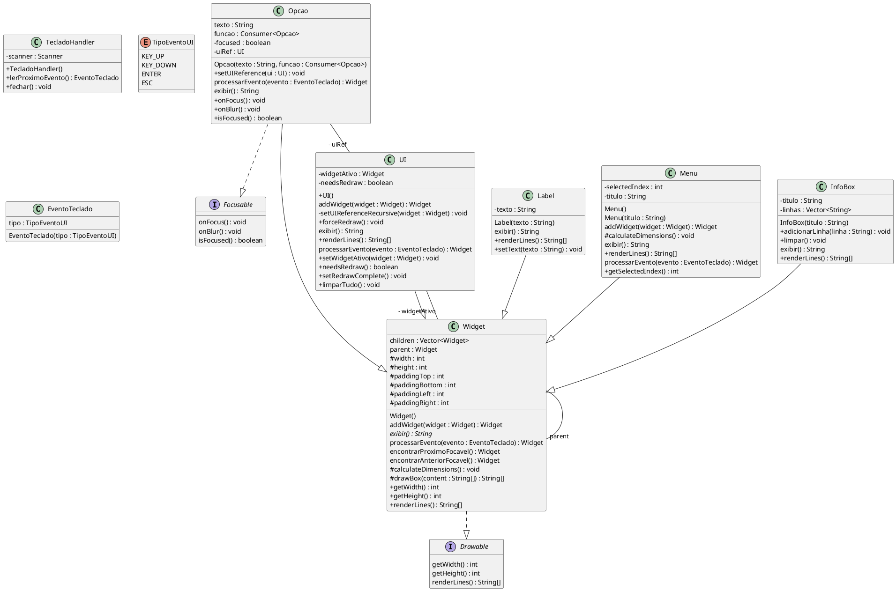
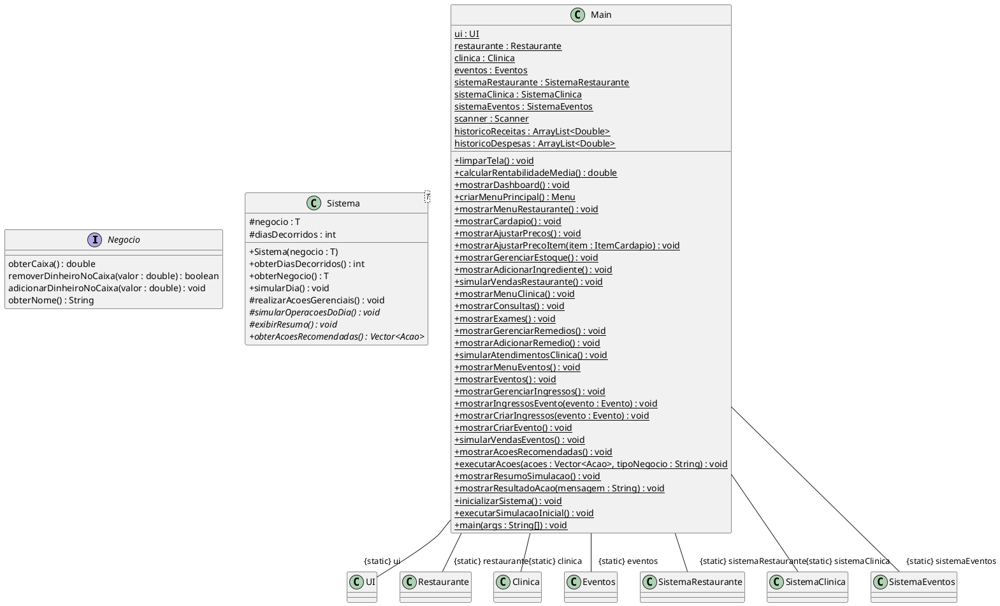
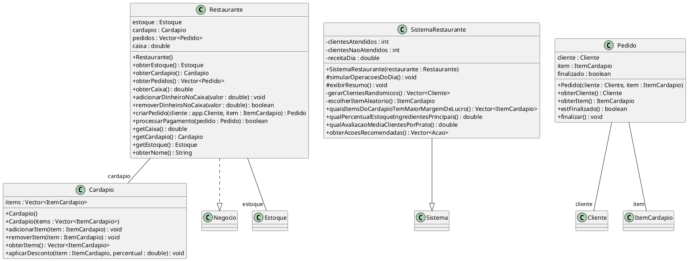
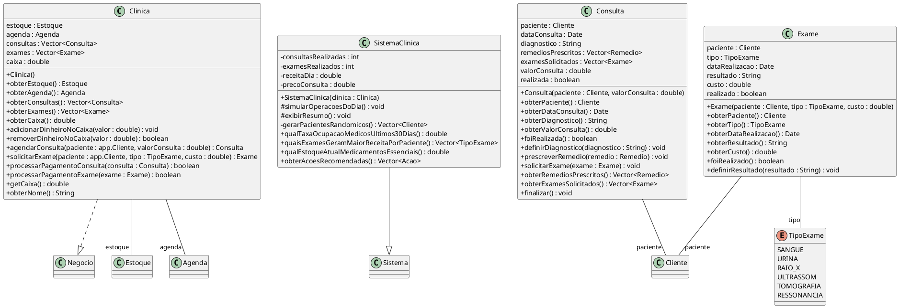
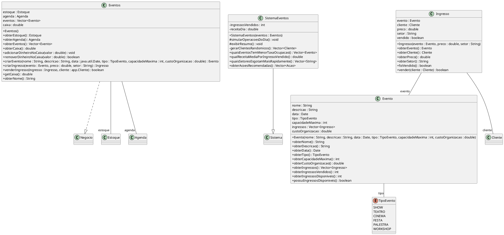
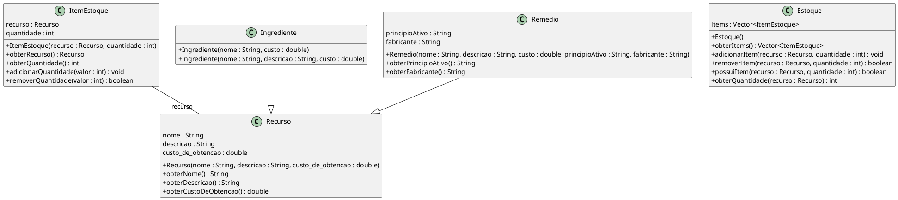

# 1. Componentes de UI e Widgets

```plantuml
@startuml UI_Components
skinparam classAttributeIconSize 0

interface Drawable {
  getWidth() : int
  getHeight() : int
  renderLines() : String[]
}

interface Focusable {
  onFocus() : void
  onBlur() : void
  isFocused() : boolean
}

class Widget {
  children : Vector<Widget>
  parent : Widget
  # width : int
  # height : int
  # paddingTop : int
  # paddingBottom : int
  # paddingLeft : int
  # paddingRight : int
  Widget()
  addWidget(widget : Widget) : Widget
  {abstract} exibir() : String
  processarEvento(evento : EventoTeclado) : Widget
  encontrarProximoFocavel() : Widget
  encontrarAnteriorFocavel() : Widget
  # calculateDimensions() : void
  # drawBox(content : String[]) : String[]
  + getWidth() : int
  + getHeight() : int
  + renderLines() : String[]
}

class UI {
  - widgetAtivo : Widget
  - needsRedraw : boolean
  + UI()
  addWidget(widget : Widget) : Widget
  - setUIReferenceRecursive(widget : Widget) : void
  + forceRedraw() : void
  exibir() : String
  + renderLines() : String[]
  processarEvento(evento : EventoTeclado) : Widget
  + setWidgetAtivo(widget : Widget) : void
  + needsRedraw() : boolean
  + setRedrawComplete() : void
  + limparTudo() : void
}

class Label {
  - texto : String
  Label(texto : String)
  exibir() : String
  + renderLines() : String[]
  + setText(texto : String) : void
}

class Menu {
  - selectedIndex : int
  - titulo : String
  Menu()
  Menu(titulo : String)
  addWidget(widget : Widget) : Widget
  # calculateDimensions() : void
  exibir() : String
  + renderLines() : String[]
  processarEvento(evento : EventoTeclado) : Widget
  + getSelectedIndex() : int
}

class Opcao {
  texto : String
  funcao : Consumer<Opcao>
  - focused : boolean
  - uiRef : UI
  Opcao(texto : String, funcao : Consumer<Opcao>)
  + setUIReference(ui : UI) : void
  processarEvento(evento : EventoTeclado) : Widget
  exibir() : String
  + onFocus() : void
  + onBlur() : void
  + isFocused() : boolean
}

class InfoBox {
  - titulo : String
  - linhas : Vector<String>
  InfoBox(titulo : String)
  + adicionarLinha(linha : String) : void
  + limpar() : void
  exibir() : String
  + renderLines() : String[]
}

class TecladoHandler {
  - scanner : Scanner
  + TecladoHandler()
  + lerProximoEvento() : EventoTeclado
  + fechar() : void
}

enum TipoEventoUI {
  KEY_UP
  KEY_DOWN
  ENTER
  ESC
}

class EventoTeclado {
  tipo : TipoEventoUI
  EventoTeclado(tipo : TipoEventoUI)
}

Widget ..|> Drawable
UI --|> Widget
Label --|> Widget
Menu --|> Widget
Opcao --|> Widget
Opcao ..|> Focusable
InfoBox --|> Widget
UI --" - widgetAtivo" Widget
Opcao --" - uiRef" UI
Widget --"parent" Widget

@enduml
```

# 2. Sistema Principal e Negócios

```plantuml
@startuml Main_System
skinparam classAttributeIconSize 0

interface Negocio {
  obterCaixa() : double
  removerDinheiroNoCaixa(valor : double) : boolean
  adicionarDinheiroNoCaixa(valor : double) : void
  obterNome() : String
}

class Sistema<T> {
  # negocio : T
  # diasDecorridos : int
  + Sistema(negocio : T)
  + obterDiasDecorridos() : int
  + obterNegocio() : T
  + simularDia() : void
  # realizarAcoesGerenciais() : void
  # {abstract} simularOperacoesDoDia() : void
  # {abstract} exibirResumo() : void
  + {abstract} obterAcoesRecomendadas() : Vector<Acao>
}

class Main {
  {static} ui : UI
  {static} restaurante : Restaurante
  {static} clinica : Clinica
  {static} eventos : Eventos
  {static} sistemaRestaurante : SistemaRestaurante
  {static} sistemaClinica : SistemaClinica
  {static} sistemaEventos : SistemaEventos
  {static} scanner : Scanner
  {static} historicoReceitas : ArrayList<Double>
  {static} historicoDespesas : ArrayList<Double>
  + {static} limparTela() : void
  + {static} calcularRentabilidadeMedia() : double
  + {static} mostrarDashboard() : void
  + {static} criarMenuPrincipal() : Menu
  + {static} mostrarMenuRestaurante() : void
  + {static} mostrarCardapio() : void
  + {static} mostrarAjustarPrecos() : void
  + {static} mostrarAjustarPrecoItem(item : ItemCardapio) : void
  + {static} mostrarGerenciarEstoque() : void
  + {static} mostrarAdicionarIngrediente() : void
  + {static} simularVendasRestaurante() : void
  + {static} mostrarMenuClinica() : void
  + {static} mostrarConsultas() : void
  + {static} mostrarExames() : void
  + {static} mostrarGerenciarRemedios() : void
  + {static} mostrarAdicionarRemedio() : void
  + {static} simularAtendimentosClinica() : void
  + {static} mostrarMenuEventos() : void
  + {static} mostrarEventos() : void
  + {static} mostrarGerenciarIngressos() : void
  + {static} mostrarIngressosEvento(evento : Evento) : void
  + {static} mostrarCriarIngressos(evento : Evento) : void
  + {static} mostrarCriarEvento() : void
  + {static} simularVendasEventos() : void
  + {static} mostrarAcoesRecomendadas() : void
  + {static} executarAcoes(acoes : Vector<Acao>, tipoNegocio : String) : void
  + {static} mostrarResumoSimulacao() : void
  + {static} mostrarResultadoAcao(mensagem : String) : void
  + {static} inicializarSistema() : void
  + {static} executarSimulacaoInicial() : void
  + {static} main(args : String[]) : void
}

Main --"{static} ui" UI
Main --"{static} restaurante" Restaurante
Main --"{static} clinica" Clinica
Main --"{static} eventos" Eventos
Main --"{static} sistemaRestaurante" SistemaRestaurante
Main --"{static} sistemaClinica" SistemaClinica
Main --"{static} sistemaEventos" SistemaEventos

@enduml
```

# 3. Restaurante

```plantuml
@startuml Restaurant_Domain
skinparam classAttributeIconSize 0

class Restaurante {
  estoque : Estoque
  cardapio : Cardapio
  pedidos : Vector<Pedido>
  caixa : double
  + Restaurante()
  + obterEstoque() : Estoque
  + obterCardapio() : Cardapio
  + obterPedidos() : Vector<Pedido>
  + obterCaixa() : double
  + adicionarDinheiroNoCaixa(valor : double) : void
  + removerDinheiroNoCaixa(valor : double) : boolean
  + criarPedido(cliente : app.Cliente, item : ItemCardapio) : Pedido
  + processarPagamento(pedido : Pedido) : boolean
  + getCaixa() : double
  + getCardapio() : Cardapio
  + getEstoque() : Estoque
  + obterNome() : String
}

class SistemaRestaurante {
  - clientesAtendidos : int
  - clientesNaoAtendidos : int
  - receitaDia : double
  + SistemaRestaurante(restaurante : Restaurante)
  # simularOperacoesDoDia() : void
  # exibirResumo() : void
  - gerarClientesRandomicos() : Vector<Cliente>
  - escolherItemAleatorio() : ItemCardapio
  + quaisItemsDoCardapioTemMaiorMargemDeLucro() : Vector<ItemCardapio>
  + qualPercentualEstoqueIngredientesPrincipais() : double
  + qualAvaliacaoMediaClientesPorPrato() : double
  + obterAcoesRecomendadas() : Vector<Acao>
}

class Cardapio {
  items : Vector<ItemCardapio>
  + Cardapio()
  + Cardapio(items : Vector<ItemCardapio>)
  + adicionarItem(item : ItemCardapio) : void
  + removerItem(item : ItemCardapio) : void
  + obterItems() : Vector<ItemCardapio>
  + aplicarDesconto(item : ItemCardapio, percentual : double) : void
}

class Pedido {
  cliente : Cliente
  item : ItemCardapio
  finalizado : boolean
  + Pedido(cliente : Cliente, item : ItemCardapio)
  + obterCliente() : Cliente
  + obterItem() : ItemCardapio
  + estFinalizado() : boolean
  + finalizar() : void
}

Restaurante ..|> Negocio
SistemaRestaurante --|> Sistema
Restaurante --"estoque" Estoque
Restaurante --"cardapio" Cardapio
Pedido --"cliente" Cliente
Pedido --"item" ItemCardapio

@enduml
```

# 4. Clinica

```plantuml
@startuml Clinic_Domain
skinparam classAttributeIconSize 0

class Clinica {
  estoque : Estoque
  agenda : Agenda
  consultas : Vector<Consulta>
  exames : Vector<Exame>
  caixa : double
  + Clinica()
  + obterEstoque() : Estoque
  + obterAgenda() : Agenda
  + obterConsultas() : Vector<Consulta>
  + obterExames() : Vector<Exame>
  + obterCaixa() : double
  + adicionarDinheiroNoCaixa(valor : double) : void
  + removerDinheiroNoCaixa(valor : double) : boolean
  + agendarConsulta(paciente : app.Cliente, valorConsulta : double) : Consulta
  + solicitarExame(paciente : app.Cliente, tipo : TipoExame, custo : double) : Exame
  + processarPagamentoConsulta(consulta : Consulta) : boolean
  + processarPagamentoExame(exame : Exame) : boolean
  + getCaixa() : double
  + obterNome() : String
}

class SistemaClinica {
  - consultasRealizadas : int
  - examesRealizados : int
  - receitaDia : double
  - precoConsulta : double
  + SistemaClinica(clinica : Clinica)
  # simularOperacoesDoDia() : void
  # exibirResumo() : void
  - gerarPacientesRandomicos() : Vector<Cliente>
  + qualTaxaOcupacaoMedicosUltimos30Dias() : double
  + quaisExamesGeramMaiorReceitaPorPaciente() : Vector<TipoExame>
  + qualEstoqueAtualMedicamentosEssenciais() : double
  + obterAcoesRecomendadas() : Vector<Acao>
}

class Consulta {
  paciente : Cliente
  dataConsulta : Date
  diagnostico : String
  remediosPrescritos : Vector<Remedio>
  examesSolicitados : Vector<Exame>
  valorConsulta : double
  realizada : boolean
  + Consulta(paciente : Cliente, valorConsulta : double)
  + obterPaciente() : Cliente
  + obterDataConsulta() : Date
  + obterDiagnostico() : String
  + obterValorConsulta() : double
  + foiRealizada() : boolean
  + definirDiagnostico(diagnostico : String) : void
  + prescreverRemedio(remedio : Remedio) : void
  + solicitarExame(exame : Exame) : void
  + obterRemediosPrescritos() : Vector<Remedio>
  + obterExamesSolicitados() : Vector<Exame>
  + finalizar() : void
}

class Exame {
  paciente : Cliente
  tipo : TipoExame
  dataRealizacao : Date
  resultado : String
  custo : double
  realizado : boolean
  + Exame(paciente : Cliente, tipo : TipoExame, custo : double)
  + obterPaciente() : Cliente
  + obterTipo() : TipoExame
  + obterDataRealizacao() : Date
  + obterResultado() : String
  + obterCusto() : double
  + foiRealizado() : boolean
  + definirResultado(resultado : String) : void
}

enum TipoExame {
  SANGUE
  URINA
  RAIO_X
  ULTRASSOM
  TOMOGRAFIA
  RESSONANCIA
}

Clinica ..|> Negocio
SistemaClinica --|> Sistema
Clinica --"estoque" Estoque
Clinica --"agenda" Agenda
Consulta --"paciente" Cliente
Exame --"paciente" Cliente
Exame --"tipo" TipoExame

@enduml
```

# 5. Eventos

```plantuml
@startuml Events_Domain
skinparam classAttributeIconSize 0

class Eventos {
  estoque : Estoque
  agenda : Agenda
  eventos : Vector<Evento>
  caixa : double
  + Eventos()
  + obterEstoque() : Estoque
  + obterAgenda() : Agenda
  + obterEventos() : Vector<Evento>
  + obterCaixa() : double
  + adicionarDinheiroNoCaixa(valor : double) : void
  + removerDinheiroNoCaixa(valor : double) : boolean
  + criarEvento(nome : String, descricao : String, data : java.util.Date, tipo : TipoEvento, capacidadeMaxima : int, custoOrganizacao : double) : Evento
  + criarIngresso(evento : Evento, preco : double, setor : String) : Ingresso
  + venderIngresso(ingresso : Ingresso, cliente : app.Cliente) : boolean
  + getCaixa() : double
  + obterNome() : String
}

class SistemaEventos {
  - ingressosVendidos : int
  - receitaDia : double
  + SistemaEventos(eventos : Eventos)
  # simularOperacoesDoDia() : void
  # exibirResumo() : void
  - gerarClientesRandomicos() : Vector<Cliente>
  + quaisEventosTemMenorTaxaOcupacao() : Vector<Evento>
  + qualReceitaMediaPorIngressoVendido() : double
  + quaisSetoresEsgotamMaisRapidamente() : Vector<String>
  + obterAcoesRecomendadas() : Vector<Acao>
}

class Evento {
  nome : String
  descricao : String
  data : Date
  tipo : TipoEvento
  capacidadeMaxima : int
  ingressos : Vector<Ingresso>
  custoOrganizacao : double
  + Evento(nome : String, descricao : String, data : Date, tipo : TipoEvento, capacidadeMaxima : int, custoOrganizacao : double)
  + obterNome() : String
  + obterDescricao() : String
  + obterData() : Date
  + obterTipo() : TipoEvento
  + obterCapacidadeMaxima() : int
  + obterCustoOrganizacao() : double
  + obterIngressos() : Vector<Ingresso>
  + obterIngressosVendidos() : int
  + obterIngressosDisponiveis() : int
  + possuiIngressosDisponiveis() : boolean
}

class Ingresso {
  evento : Evento
  cliente : Cliente
  preco : double
  setor : String
  vendido : boolean
  + Ingresso(evento : Evento, preco : double, setor : String)
  + obterEvento() : Evento
  + obterCliente() : Cliente
  + obterPreco() : double
  + obterSetor() : String
  + foiVendido() : boolean
  + vender(cliente : Cliente) : boolean
}

enum TipoEvento {
  SHOW
  TEATRO
  CINEMA
  FESTA
  PALESTRA
  WORKSHOP
}

Eventos ..|> Negocio
SistemaEventos --|> Sistema
Eventos --"estoque" Estoque
Eventos --"agenda" Agenda
Ingresso --"evento" Evento
Ingresso --"cliente" Cliente
Evento --"tipo" TipoEvento

@enduml
```

# 6. Acoes

```plantuml
@startuml Actions_System
skinparam classAttributeIconSize 0

class Acao {
  + {abstract} executar() : void
  + {abstract} obterNome() : String
  + {abstract} obterDescricao() : String
  + verificarSePodeExecutar() : boolean
}

class BuscarEmprestimo {
  valorEmprestimo : double
  taxaJuros : double
  + BuscarEmprestimo(valorEmprestimo : double, taxaJuros : double)
  + executar() : void
  + obterNome() : String
  + obterDescricao() : String
}

class AjustarPrecoConsulta {
  precoAtual : double
  novoPreco : double
  motivo : String
  + AjustarPrecoConsulta(precoAtual : double, novoPreco : double, motivo : String)
  + executar() : void
  + obterNome() : String
  + obterDescricao() : String
}

class AjustarPrecoExame {
  tipoExame : TipoExame
  precoAtual : double
  novoPreco : double
  + AjustarPrecoExame(tipoExame : TipoExame, precoAtual : double, novoPreco : double)
  + executar() : void
  + obterNome() : String
  + obterDescricao() : String
}

class ContratarMedico {
  clinica : Clinica
  nome : String
  especialidade : String
  salario : double
  + ContratarMedico(clinica : Clinica, nome : String, especialidade : String, salario : double)
  + executar() : void
  + obterNome() : String
  + obterDescricao() : String
}

class ComprarEquipamento {
  clinica : Clinica
  equipamento : String
  custo : double
  + ComprarEquipamento(clinica : Clinica, equipamento : String, custo : double)
  + executar() : void
  + obterNome() : String
  + obterDescricao() : String
}

class AgendarManutencao {
  clinica : Clinica
  custo : double
  descricao : String
  + AgendarManutencao(clinica : Clinica, custo : double, descricao : String)
  + executar() : void
  + obterNome() : String
  + obterDescricao() : String
}

BuscarEmprestimo --|> Acao
AjustarPrecoConsulta --|> Acao
AjustarPrecoExame --|> Acao
ContratarMedico --|> Acao
ComprarEquipamento --|> Acao
AgendarManutencao --|> Acao

AjustarPrecoExame --"tipoExame" TipoExame
ContratarMedico --"clinica" Clinica
ComprarEquipamento --"clinica" Clinica
AgendarManutencao --"clinica" Clinica

@enduml
```

# 7. Estoque e Recursos

```plantuml
@startuml Inventory_System
skinparam classAttributeIconSize 0

class Recurso {
  nome : String
  descricao : String
  custo_de_obtencao : double
  + Recurso(nome : String, descricao : String, custo_de_obtencao : double)
  + obterNome() : String
  + obterDescricao() : String
  + obterCustoDeObtencao() : double
}

class Estoque {
  items : Vector<ItemEstoque>
  + Estoque()
  + obterItems() : Vector<ItemEstoque>
  + adicionarItem(recurso : Recurso, quantidade : int) : void
  + removerItem(recurso : Recurso, quantidade : int) : boolean
  + possuiItem(recurso : Recurso, quantidade : int) : boolean
  + obterQuantidade(recurso : Recurso) : int
}

class ItemEstoque {
  recurso : Recurso
  quantidade : int
  + ItemEstoque(recurso : Recurso, quantidade : int)
  + obterRecurso() : Recurso
  + obterQuantidade() : int
  + adicionarQuantidade(valor : int) : void
  + removerQuantidade(valor : int) : boolean
}

class Ingrediente {
  + Ingrediente(nome : String, custo : double)
  + Ingrediente(nome : String, descricao : String, custo : double)
}

class Remedio {
  principioAtivo : String
  fabricante : String
  + Remedio(nome : String, descricao : String, custo : double, principioAtivo : String, fabricante : String)
  + obterPrincipioAtivo() : String
  + obterFabricante() : String
}

Ingrediente --|> Recurso
Remedio --|> Recurso
ItemEstoque --"recurso" Recurso

@enduml
```